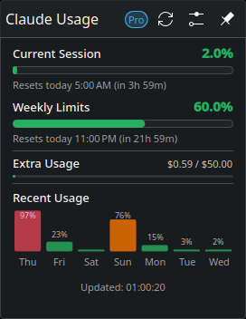

# Claude Usage Tracker

A KDE Plasma 6 widget that displays your Claude AI usage limits and quotas directly in your panel.

## Preview



## Features

- **Panel donut chart** showing current session utilization at a glance
- **Session (5-hour) and weekly (7-day) usage bars** with reset time countdowns
- **Per-model breakdown** for Sonnet and Opus utilization
- **Extra usage tracking** for paid overage credits
- **Daily usage bar chart** for recent usage history
- **Configurable auto-refresh** interval
- **Auto-login** via Claude Code CLI credentials
- **Pin popup** to keep the detail view open
- **Update notifications** with one-click install when a new release is published

## Requirements

- KDE Plasma 6
- Python 3 with the `requests` module (`pip install requests`)
- [Claude Code CLI](https://docs.anthropic.com/en/docs/claude-code) (run `claude login` to set up credentials)

## Installation

Just copy and paste this single line into your terminal:

```bash
curl -fsSL https://raw.githubusercontent.com/HuskyDevClub/claude-usage-kde-tracker/main/install-remote.sh | bash
```

Then right-click your panel, select **Add Widgets**, and search for **Claude**.

## Updating

The widget checks GitHub once a day for a newer release. When one is available, a notice appears at the top of the popup with an **Update now** button that downloads and installs it — followed by a **Restart Plasma** button to apply it.

**Skip** hides the notice until a version newer than the one you skipped is released. Automatic checks can be turned off in the widget's settings.

### Checking manually

Manual checks work whether or not automatic checking is enabled, and always ask GitHub directly rather than reusing the cached daily answer:

- **Check now** in the widget's settings, under **Updates** — the result appears right there, and the widget picks it up too, or
- **Check for Updates** in the widget's right-click menu, which opens the popup with the result

Either way you get an answer: an update notice, *"You're up to date"*, or the reason the check failed. A manual check also un-skips a version you previously skipped.

From a terminal:

```bash
python3 ~/.local/share/plasma/plasmoids/com.github.huskydevclub.claude-usage-kde-tracker/contents/code/check_update.py --force
```

To update manually instead, re-run the install command:

```bash
curl -fsSL https://raw.githubusercontent.com/HuskyDevClub/claude-usage-kde-tracker/main/install-remote.sh | bash
```

## Uninstallation

```bash
curl -fsSL https://raw.githubusercontent.com/HuskyDevClub/claude-usage-kde-tracker/main/uninstall.sh | bash
```

## Configuration

Right-click the widget and select **Configure** to adjust:

| Setting | Default | Description |
|---|---|---|
| Refresh interval | 5 min | How often to fetch fresh data from the API (1-60 min) |
| Show extra usage | On | Show paid overage section |
| Show recent usage | Off | Show daily usage bar chart |
| Check for updates | On | Check GitHub daily for new releases (manual checks always available) |
| Custom colors | Off | Override theme colors, with colorblind-friendly presets |

## How it works

The widget calls the Anthropic OAuth usage API (`/api/oauth/usage`) using credentials from Claude Code CLI. A Python script ([fetch_usage.py](contents/code/fetch_usage.py)) handles authentication and API communication, while the QML frontend renders the data as interactive progress bars and charts.

Usage data is cached locally at `~/.local/share/claude-usage-tracker/usage.json` so the widget can display stale data instantly while a fresh fetch runs in the background.

Update checks ([check_update.py](contents/code/check_update.py)) compare the `Version` field in `metadata.json` against the latest GitHub release tag, caching the answer for 24 hours in `~/.local/share/claude-usage-tracker/update.json` to stay well inside GitHub's unauthenticated rate limit. Installing an update ([apply_update.sh](contents/code/apply_update.sh)) downloads that release's tarball and hands it to `kpackagetool6 --upgrade` after verifying the package ID matches.

## Contributing

Contributions are welcome! Whether it's bug reports, feature requests, or pull requests — every bit helps make this the best Claude usage tracker for KDE Plasma.

Here are some ways you can help:

- **Report bugs** — Open an [issue](https://github.com/HuskyDevClub/claude-usage-kde-tracker/issues) if something isn't working right
- **Suggest features** — Have an idea for a useful addition? Let us know
- **Submit pull requests** — Code improvements, UI tweaks, and documentation fixes are all appreciated
- **Share feedback** — Let us know how you use the widget and what could be better

If you'd like to contribute code, fork the repo, create a branch, and open a PR. There are no strict contribution guidelines — just keep changes focused and test before submitting.

### Releasing

The in-widget update check compares `metadata.json` to the latest GitHub release, so a release needs both halves to line up: bump `KPlugin.Version` in `metadata.json` (e.g. `26.3`), then publish a GitHub release whose tag is that version prefixed with `v` (`v26.3`). Users on older versions see the update notice within a day; a version bump without a matching release tag reaches nobody.

## License

GPL-3.0
